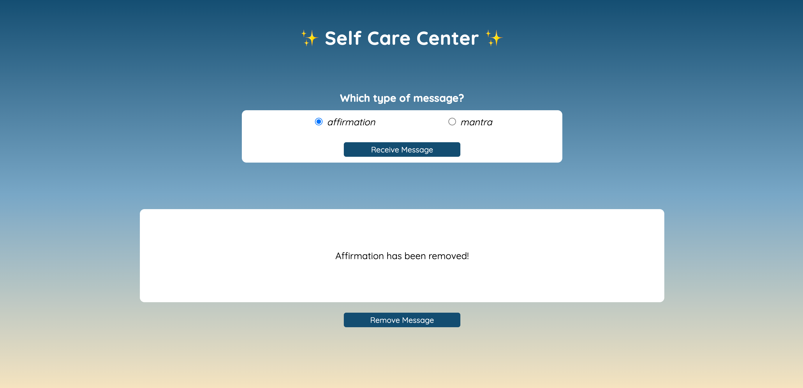

# Self-Care Center 

### Abstract:
[//]: <> For this project, I developed a "Self Care Center" webpage. Sometimes it can be quite difficult to think of affirmations or mantras to keep onself in good and healthy spirits. This application removes the brain power needed to think up your own affirmations or mantras! And allows you to remove affirmation or mantras that don't resignate with you. In more technical terms: this webpage allows a user to choose to receive either an affirmation message or a mantra message via radio buttons. When the "Receive Messge" button is then selected, a corresponding affirmation or mantra is randomly generated and displayed at the bottom of the page. Additionally, if the user is not satisfied with the message they receive, they may EITHER re-select the radio buttons and  "Receive Message" button to display a newly generated message OR they can select the "Remove Message" button to permanently remove the displayed message from the random generator and, therefore, prevent it from re-occuring. When the "Remove Message" button is selected, the user is alerted at the bottom of the page that the corresponding message was successfully removed. 

### Installation Instructions:
[//]: <> In order to install this application, you can fork and clone down this github repository: https://github.com/danazack10/self-care-center.

### Preview of App:
[//]: <> The image below shows a preview of the message that is displayed when an affirmation is permanently deleted via the "Remove Message" button (i.e. "Affirmation has been removed!")

### Context:
[//]: <> This is my second solo project at the Turing School of Software & Design. I am in Module 1 and just completed week 3 out of 27 total.

### Contributors:
[//]: <> There were no contributors. This was a solo project.

### Learning Goals:
[//]: <> The learning goal of this project was to write my own CSS and HTML code for the first time, including demonstrating an understanding of how to utilize flexbox.
Learning goals per the project webpage:
[] Gain experience building an application that utilizes HTML, CSS and JavaScript
[] Write HTML and CSS to match a provided comp
[] Understand how to listen to and respond to user events
[] Individualize my programming skill set
Link to the project webpage: https://frontend.turing.edu/projects/module-1/self-care-center.html

### Wins + Challenges:
[//]: <> A win for this project was utilizing flexbox successfully for the first time. It was very satisfying to match my webpage to the provided comp. A challenge I faced was determining the index position of the displayed affirmation/mantra, but I was able to resolve this by implementing a conditional statment with a splice property nested within a for loop.

